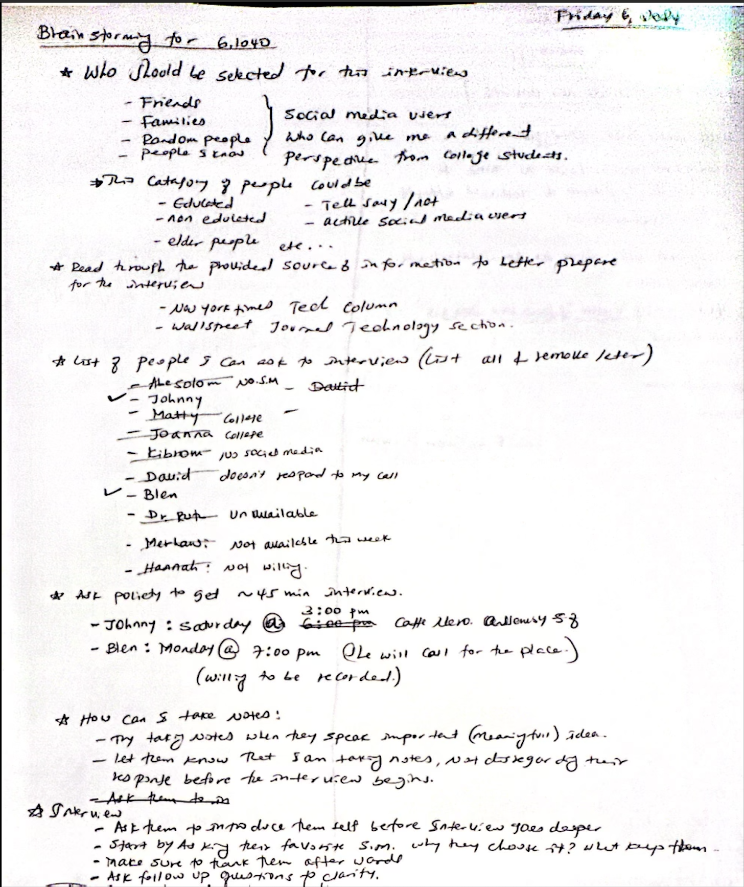
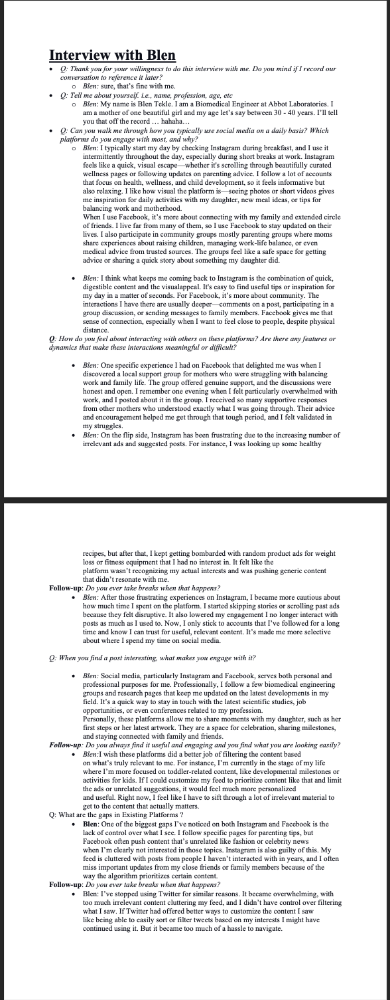
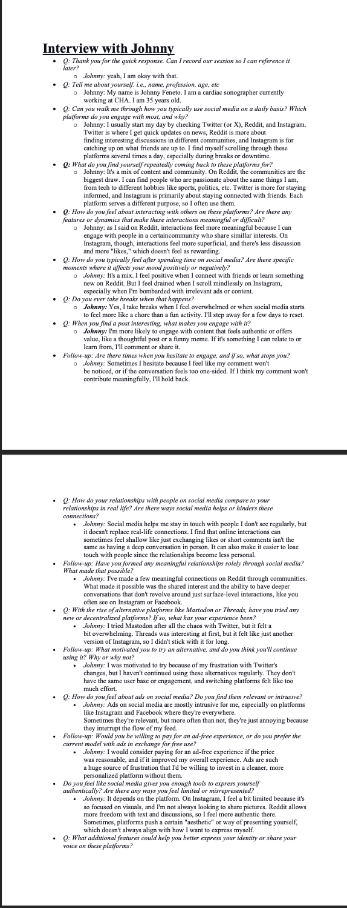

# Assignment-1: Social Media Needfinding

## Name: Yonas Mekonnen

### Hunch:

I would like to explore how social media platforms can provide more personalized and user-driven content curation to help users avoid irrelevant posts, ads, and content from unknown sources.

## Selection Criteria:

For this assignment, I intentionally selected participants to capture a broad range of perspectives on social media use, focusing on individuals who could offer unique insights into how content curation is managed across platforms. The participants are **working professionals** from various fields, not students at MIT or other colleges.

1. **Time-constrained individuals:**

   - Included **busy professionals** or **parents** who would benefit from efficient, personalized content curation.
   - Goal: Uncover how content overload and irrelevant posts hinder engagement and whether user-driven systems could improve the experience.

2. **Participants with privacy concerns:**

   - Focused on individuals who expressed discomfort with **personalized ads**, **data tracking**, and **lack of control** over feeds.
   - Goal: Gain insights into their challenges with algorithmic content curation and highlight the need for **transparency** and **user control**.

3. **Less tech-savvy users (non-developers):**

   - Selected participants with limited technical expertise to explore how they interact with social media, particularly regarding **complex algorithms** and **unintuitive interfaces**.
   - Goal: Discover how **simplified, user-driven customization** could enhance their experience.

4. **Skeptical social media users:**

   - Included individuals familiar with popular platforms (**Instagram**, **Twitter**, **Reddit**, **Facebook**) but skeptical of newer platforms.
   - Goal: Understand their **hesitations** and reveal **trust** and **algorithmic concerns** related to content relevancy and overload.

5. **Mid-career professionals (ages 30-40):**

   - Focused on individuals balancing **work**, **family**, and **social media**, to gain thier perspective as compared to younger users.
   - Goal: Highlight the need for content tailored to **personal** and **professional** interests.

6. **Parents (mother):**
   - Specifically included a **mother** to explore how platforms cater to **family** and **community interactions**.
   - Goal: Gain insights into **content relevancy** and **safety** from a parent's perspective.

By interviewing such a diverse group, I aim to uncover **insights** regarding users' challenges with **content personalization**, **platform trust**, and **usability** across various demographics and usage patterns.

## Interview Report:

1. ### Interview-1: Summary and Analysis - Blen

**Blen**, a working mother and **biomedical engineer** at **Abbott Laboratories**, offered insightful details about her daily social media usage, focusing primarily on **Instagram** and **Facebook**.

- **Instagram**: She uses Instagram for quick, visual content related to **health**, **wellness**, **news**, **parenting tips**, and **humorous posts**.
- **Facebook**: She relies on Facebook for **deeper community engagement**, particularly through **Facebook groups**. Here, she connects with **family and friends** abroad, utilizing both **public posts** and **private messaging**.

Blen emphasized the contrast between Instagram’s **"shallow"** yet convenient nature and Facebook’s **"meaningful"** connections:

> "Instagram is great when I just want to scroll through and not think too much, but on Facebook, I feel like I'm part of a community."

This comment highlights the dual roles these platforms play in her social media experience.

<!-- ### Key Tension: Facebook's Content Curation -->

A major tension surfaced as Blen discussed her growing frustration with **Facebook's content curation**, particularly the influx of **irrelevant ads** and posts, which don’t align with her interests in **friends**, **family**, and **parenting groups**. She expressed her frustration by saying:

> "I don't get why Facebook keeps showing me ads for things I don't care about, when all I really want to see are updates from my groups or friends."

This dissatisfaction has led Blen to shift her engagement away from Facebook and towards Instagram, where she feels she has more control over the content she sees:

> "I can choose who I follow on Instagram, and I don't get bombarded with things I didn't ask for."

This shift underscores the contradiction between Blen's appreciation for Facebook’s deeper **community interactions** and her disillusionment with its **content curation system**, which ultimately drives her toward a platform where she feels a greater sense of control.

<!-- ### Privacy Concerns and Desired Features -->

In addition to content curation frustrations, Blen voiced significant concerns regarding **privacy**, particularly around sharing images of her daughter. She stated:

> "I'm always hesitant to post pictures of her who knows what they'll do with those photos."

Blen expressed a desire for **precise privacy settings** and better tools to **customize her feed** to show more relevant content based on her current life stage:

> "I wish I could tell the algorithm what I need right now, like more parenting advice and less random ads."

<!-- ### Need for Platforms Tailored to Niche Audiences -->

Blen also reflected on how current social media platforms fail to cater to **niche audiences**, such as **working mothers**. She expressed interest in a platform designed to meet her dual roles as a **professional** and a **parent**, saying:

> "It would be so helpful to have a space just for moms like me, where I don't have to wade through everything else."

Her suggestions for features such as **topic-based filters** and **community subgroups** emphasize the need for more **user-driven customization** and **improved content curation**.

<!-- ### Conclusion -->

Her experiences illustrate the delicate balance between seeking **quick, visually appealing content** and desiring **meaningful, supportive interactions**, while also grappling with **privacy concerns** and the **limitations** of current social media platforms. Her feedback highlights the need for better **personalization**, **privacy controls**, and **niche platforms** that cater to specific life roles, such as **working mothers**.

2. ### Interview-2: Summary and Analysis - Johnny

**Johnny**, a busy **cardiac sonographer**, engages with multiple social media platforms, each serving a distinct purpose in his life. He uses **Twitter**, **Reddit**, and **Instagram**, but each platform fulfills a unique role.

- **Twitter**: Johnny turns to Twitter for **quick news updates**.
- **Reddit**: He values Reddit for **meaningful discussions** in specific interest groups.
- **Instagram**: Instagram helps him stay connected with **friends**, offering a more casual way to keep up with others.

However, a contradiction began to emerge in Johnny's experience with **Instagram**. While he initially appreciated the platform for its **casual connections**, he has become increasingly frustrated with its **content curation**. As Johnny put it,

> "It felt like I had less control over what I saw."

Johnny reflected on how Instagram's algorithm often pushes **irrelevant ads** and posts from people he doesn't follow, undermining his overall user experience. This **loss of control** over his feed has led Johnny to reduce his engagement on the platform, highlighting a key tension between his desire for genuine connection and his growing frustration with Instagram's algorithms.

<!-- ### The Contrast Between Reddit and Instagram -->

The tension between Johnny's experiences on **Reddit** and **Instagram** became especially revealing. He described Reddit as a platform where he feels part of a **community**, drawn to its **sub group** and the **upvoting system** that highlights thoughtful contributions. By contrast, Johnny found Instagram's interactions to be increasingly **superficial**. He expressed this by saying:

> "The engagement on Instagram feels more like a quick scroll rather than a meaningful connection."

This **contradiction** in platform dynamics clearly demonstrates how Johnny values **quality interactions** over **quantity**, preferring the deeper connections he finds on Reddit.

<!-- ### Privacy Concerns Across Platforms -->

Despite these meaningful interactions, Johnny is concerned about privacy violations across social media platforms. He voiced concerns about how much **personal data** these platforms collect and what they do with it. Johnny emphasized this concern, stating:

> "I’m always concerned about how much data they collect and what they do with it."

This adds another layer of tension to Johnny's social media experience. While he appreciates certain aspects of these platforms, his **distrust** in how they handle **personal data** is growing.

<!-- ### Broader Challenges for Social Media Users -->

Johnny’s experience highlights a broader challenge that many social media users face today: the conflict between wanting **personalized, meaningful interactions** and feeling **overwhelmed** or **disconnected** by the content algorithms deliver. His reflections reveal the **contradictions** in his relationship with these platforms. On one hand, Johnny desires more **control** over the content he consumes; on the other hand, he is drawn to platforms like Reddit for their **community-driven structure**.

Johnny suggested that platforms should prioritize:

> "Better content filtering and more transparent privacy settings."

This reflects his desire for more **user-driven customization**. Ultimately, Johnny's perspective emphasizes the need for future social media platforms to provide not just **connections**, but **thoughtful, personalized experiences** that balance **user control**, **meaningful engagement**, and **data privacy**.

## Design Opportunities:

1. **_Mood-Based Feed Curation:_**

- **Opportunity:** Imagine a feature allowing users to adjust their social media feed based on their mood or emotional state. With a simple toggle or slider, users can choose between different content modes like "Inspiration," "Relaxation," "Learning," or "Social Connection" to tailor the content they see instantly.
- **Why It Matters:** Blen and Johnny both expressed frustration with the static, irrelevant content pushed by algorithms. A mood-based system would offer a more dynamic and personalized experience and potentially revolutionize the user experience. This creative approach could re-engage users by making social media feel more responsive and empathetic to their state of mind, reducing content fatigue and improving emotional well-being.

2. **_Ad Blocker with a Purpose (Charity-Driven Ad Bypass):_**

- **Opportunity:** A unique, user-centric ad blocker that allows users to skip ads entirely or watch ads, knowing that ad revenue would be donated to a charity of their choice. This design choice considers the user's ad experience while supporting causes they care about.
- **Why It Matters:** Johnny's frustration with irrelevant ads and Blen's concerns over privacy indicate a need for more control over advertisements. This feature allows users to either remove ads entirely or engage with them meaningfully. It offers a non-trivial, creative twist that benefits both the user and the wider community, turning an annoyance into an opportunity for social good.

3 **_Content Detox Timer:_**

- **Opportunity:** A built-in "content detox" feature that allows users to schedule breaks from overwhelming content. Users could activate a detox timer that blocks all non-essential content (ads, random posts) for a chosen period, allowing only highly relevant or selected posts (e.g., family updates, essential news).
- **Why It Matters:** Blen and Johnny expressed concerns over content overload and time wasted on irrelevant posts. This feature would allow users to engage more meaningfully during stressful or busy periods by curating only the most relevant content for a set time. It creates a healthier, more intentional social media experience, encouraging balance and mindful use of the platforms.

4. **_Privacy Control Dashboard with Real-Time Feedback:_**

- **Opportunity:** Both Blen and Johnny highlighted concerns around privacy, particularly regarding sharing personal data and how algorithms leverage this information. A privacy control dashboard that provides real-time feedback on what data is being used and how it is influencing the content and ads displayed could give users greater transparency and control over their digital footprint.
- **Why It Matters:** Privacy concerns are becoming more central for users like Blen, who worry about sharing family photos, and Johnny, who is uneasy about platforms collecting his data. This feature could increase user trust and encourage more personalized, informed interactions by offering real-time transparency. Users would care about this as it empowers them to monitor and restrict data usage, reducing anxiety around data collection.

5. **_Content Challenge Mode:_**

- **Opportunity:** A gamified feature that encourages users to improve their feed over time by completing small challenges like "mute five accounts" or "discover three new communities." Users earn rewards like fewer ads or access to exclusive content by completing these tasks.  It's Unique because this turns feed curation into a fun, engaging process, encouraging users to take small steps to optimize their content consumption. It gamified a tedious or ignored task, making content control more interactive.
- **Why It Matters:** Turning curation into a game keeps the user experience fresh and relevant. It also addresses Blen and Johnny's complaints about declining feed relevancy without requiring users to sift through settings, making personalization more accessible and enjoyable manually.

## Interview notes & Materials

- Here is the hand writen planning material 
- Here is the Transcript of first interview 
- Here is the Transcript of second interview 
