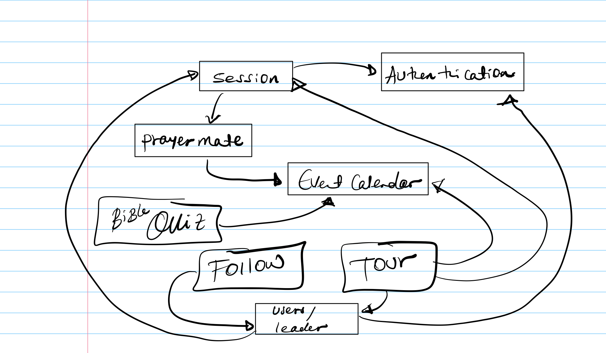

# Assignment 3: Convergent Design


## Product Pitch: OrthoNet

OrthoNet is a digital platform created specifically for the Orthodox Christian community. It’s designed for individuals, families, religious groups, priests, and spiritual leaders who want a space to grow their faith, connect with others, and engage in meaningful conversations. Unlike other social media platforms, OrthoNet is focused on prayer, learning, and building solid relationships within the faith.

The PrayerMate feature allows users to create prayer groups, join live prayer sessions, and connect through text, audio, or video prayers. The Religious Event Calendar helps users stay up-to-date with church services, local events, and global religious holidays so they never miss an important occasion.

Additionally, OrthoNet includes a fun Bible Quiz feature where users can test their knowledge, compete on leaderboards, and improve their understanding of scripture. With FollowReligiousLeaders, users can keep up with their favorite priests and leaders, receiving updates on new sermons, posts, and activities. For a deeper connection, Virtual Pilgrimage Tours lets users explore significant religious sites with 360° views and guided experiences, bringing these places to life from anywhere in the world.

With its focus on privacy and safety, OrthoNet provides a secure environment for Orthodox Christians to connect, share, and grow in their faith, making it the perfect online space for believers to deepen their spiritual journey.

## Fuctional Design
#### Concept-1: PrayerMate

**Purpose**: Facilitate communal prayers by connecting users in virtual prayer sessions.

**Principle**:
After creating a prayer group and inviting members to join, when a prayer session is started, members can participate in real-time through text, audio, or video interactions, contributing to a shared spiritual experience:
`createPrayerGroup(user, title, topic, group); joinPrayerGroup(user, groupID); startPrayerSession(groupID, session)`

### State
- **PrayerGroups**: set `Group`
- **GroupID**: set `Integer`
- **Members**: set `User`
- **PrayerTopic**: `GroupID` -> one `String`
- **ActiveSession**: `GroupID` -> lone `Session`

### Actions
- **createPrayerGroup** (`user: User`, `title: String`, `topic: String`, `out group: Group`)
  - `groupID` not in `PrayerGroups`
  - `group.Members := {user}`
  - `group.PrayerTopic := topic`
  - `PrayerGroups += group`

- **joinPrayerGroup** (`user: User`, `groupID: Integer`)
  - `groupID` in `PrayerGroups.GroupID`
  - `user` not in `group.Members`
  - `group.Members += user`

- **startPrayerSession** (`groupID: Integer`, `out session: Session`)
  - `groupID` in `PrayerGroups.GroupID`
  - `session.GroupID := groupID`
  - `ActiveSession[groupID] := session`

- **endPrayerSession** (`session: Session`)
  - `session` in `ActiveSession`
  - `ActiveSession[session.GroupID] := none`

- **leavePrayerGroup** (`user: User`, `groupID: Integer`)
  - `groupID` in `PrayerGroups.GroupID`
  - `user` in `group.Members`
  - `group.Members -= user`

---

### Concept-2: ReligiousEventCalendar

**Purpose**: Keep users informed about upcoming religious events and encourage participation.

**Principle**:
After subscribing to events of interest, users will receive notifications and reminders for those events, facilitating engagement:
`createEvent(user, title, location, startTime, endTime, event); subscribeToEvent(user, eventID)`

### State
- **Events**: set `Event`
- **EventID**: set `Integer`
- **HostID**: `EventID` -> one `User`
- **Location**: `EventID` -> one `String`
- **StartTime**: `EventID` -> one `DateTime`
- **Subscriptions**: `User` -> set `Event`

### Actions
- **createEvent** (`user: User`, `title: String`, `location: String`, `startTime: DateTime`, `endTime: DateTime`, `out event: Event`)
  - `eventID` not in `Events`
  - `event.HostID := user`
  - `event.Location := location`
  - `event.StartTime := startTime`
  - `event.EndTime := endTime`
  - `Events += event`

- **subscribeToEvent** (`user: User`, `eventID: Integer`)
  - `eventID` in `Events.EventID`
  - `user` not in `Subscriptions[eventID]`
  - `Subscriptions[user] += eventID`

- **unsubscribeFromEvent** (`user: User`, `eventID: Integer`)
  - `eventID` in `Subscriptions[user]`
  - `Subscriptions[user] -= eventID`

- **viewEventDetails** (`eventID: Integer`, `out event: Event`)
  - `eventID` in `Events.EventID`
  - `event := Events[eventID]`

---

### Concept-3 : BibleQuiz

**Purpose**: Promote learning of scripture through interactive quizzes and challenges.

**Principle**:
After starting a quiz and answering questions correctly, users can see their progress and score improve, encouraging continuous learning:
`startQuiz(user, quizID, quiz); answerQuestion(user, quizID, questionID, selectedOption, correct)`

### State
- **Quizzes**: set `Quiz`
- **QuizID**: set `Integer`
- **UserQuizRecord**: `User` -> set `Quiz`
- **CorrectAnswer**: `QuizID` -> set `Question`

### Actions
- **startQuiz** (`user: User`, `quizID: Integer`, `out quiz: Quiz`)
  - `quizID` in `Quizzes`
  - `user` not in `UserQuizRecord[quizID]`
  - `UserQuizRecord[user] += quizID`

- **answerQuestion** (`user: User`, `quizID: Integer`, `questionID: Integer`, `selectedOption: String`, `out correct: Boolean`)
  - `quizID` in `UserQuizRecord[user]`
  - `questionID` in `Quizzes[quizID]`
  - `correct := (Quizzes[quizID].CorrectAnswer[questionID] = selectedOption)`

- **viewQuizLeaderboard** (`quizID: Integer`, `out leaderboard: set User`)
  - `quizID` in `Quizzes`
  - `leaderboard := {u | u in UserQuizRecord and quizID in UserQuizRecord[u]}`

---
### Concept-4: FollowReligiousLeaders

**Purpose**: Connect users with their preferred religious leaders by following their content.

**Principle**:
After following a religious leader, users will receive updates on new sermons, posts, and activities, enhancing spiritual guidance:
`followLeader(user, leaderID); viewLeaderPosts(leaderID, items)`

### State
- **Leaders**: set `Leader`
- **LeaderID**: set `Integer`
- **Followers**: `User` -> set `Leader`
- **Posts**: `LeaderID` -> set `items`

### Actions
- **followLeader** (`user: User`, `leaderID: Integer`)
  - `leaderID` in `Leaders`
  - `user` not in `Followers[leaderID]`
  - `Followers[user] += leaderID`

- **unfollowLeader** (`user: User`, `leaderID: Integer`)
  - `leaderID` in `Leaders`
  - `user` in `Followers[leaderID]`
  - `Followers[user] -= leaderID`

- **viewLeaderPosts** (`leaderID: Integer`, `out posts: set Post`)
  - `leaderID` in `Leaders`
  - `posts := Posts[leaderID]`

---

### Concept-5: PilgrimageTouring

**Purpose**: Offer users immersive virtual tours of significant Orthodox Christian sites to experience spiritual journeys remotely.

**Principle**:
After starting a virtual pilgrimage tour, users can explore historical sites through 360° views, listen to narrations, and join live group tours, enhancing their spiritual understanding and connection:
`startTour(user, tourID, tour); joinGroupTour(user, tourID); viewTourDetails(tourID, tourDetails)`

### State
- **Tours**: set `Tour`
- **TourID**: set `Integer`
- **UserTourParticipation**: `User` -> set `Tour`
- **AvailableDates**: `TourID` -> set `Date`
- **TourDescription**: `TourID` -> one `String`

### Actions
- **startTour** (`user: User`, `tourID: Integer`, `out tour: Tour`)
  - `tourID` in `Tours`
  - `user` not in `UserTourParticipation[tourID]`
  - `UserTourParticipation[user] += tourID`

- **joinGroupTour** (`user: User`, `tourID: Integer`)
  - `tourID` in `Tours`
  - `tourID` in `AvailableDates`
  - `user` in `UserTourParticipation[tourID]`

- **viewTourDetails** (`tourID: Integer`, `out tourDetails: Tour`)
  - `tourID` in `Tours`
  - `tourDetails := Tours[tourID]`

- **leaveTour** (`user: User`, `tourID: Integer`)
  - `user` in `UserTourParticipation[tourID]`
  - `UserTourParticipation[user] -= tourID`

### Concept-6: Authentication

**Purpose**: Verify user identities and manage secure access to the platform.

**Principle**:
After a user registers with a unique username and secure password, they can log in by providing the same credentials. Passwords are stored in a hashed format to prevent unauthorized access. The user must authenticate before initiating a session and accessing app features.

### State
- **RegisteredUsers**: set `User`
- **UserID**: set `Integer`
- **Username**: `RegisteredUsers` -> one `String`
- **Password**: `RegisteredUsers` -> one `String` (hashed)
- **Email**: `UserID` -> one `String`

### Actions
- **registerUser** (`username: String`, `password: String`, `email: String`, `out user: User`)
  - `username` not in `RegisteredUsers.Username`
  - `user` is a new `User`
  - `Password[user] := hash(password)`
  - `Username[user] := username`
  - `Email[user] := email`
  - `RegisteredUsers += user`

- **authenticateUser** (`username: String`, `password: String`, `out user: User`)
  - `username` in `RegisteredUsers.Username`
  - `Password[Username = username] = hash(password)`
  - `user` is the `User` corresponding to `username`

- **changePassword** (`user: User`, `oldPassword: String`, `newPassword: String`)
  - `user` in `RegisteredUsers`
  - `Password[user] = hash(oldPassword)`
  - `Password[user] := hash(newPassword)`

- **resetPassword** (`username: String`, `email: String`, `newPassword: String`)
  - `username` in `RegisteredUsers.Username`
  - `Email[Username = username] = email`
  - `Password[Username = username] := hash(newPassword)`

---

### Concept-7: Session Management

**Purpose**: Manage and track user sessions to ensure secure interactions with the application.

**Principle**:
After a user successfully authenticates, a session is created to track their interactions within the app. Session management includes starting, tracking, and ending sessions, providing a secure and consistent user experience.

### State
- **ActiveSessions**: set `Session`
- **User**:  one `User`

### Actions
- **startSession** (`user: User`, `out session: Session`)
  - start session for a user

- **endSession** (`user: User`)
  - end active session

- **getSession** (`session: Session`, `out user: User`)
  - `user` in `AuthenticatedUsers`
  - `session` := `UserSession[user]`
  gets the current user from an active session

---


### Synchronizations for OrthoNet
```
include Shorthand [ReligiousGroup]
include Session [ReligiousGroup]
include ExpiringResource [Event]
include Subscription [Event]
include Quiz [User]
include Subscription [Leader]
include TourGuide [Tour]
include Authentication [User]
include SessionManagement [User]

sync createPrayerGroup (user: User, title: String, topic: String, out group: Group)
  when Shorthand.register (title, group)
  Session.start (group, initialSession)

sync joinPrayerGroup (user: User, groupID: Integer)
  when Shorthand.lookup (groupID, user)

sync startPrayerSession (groupID: Integer, out session: Session)
  when Session.start (groupID, session)

sync endPrayerSession (session: Session)
  when Session.end (session)

sync leavePrayerGroup (user: User, groupID: Integer)
  when Session.end (session)
  Shorthand.unregister (groupID)

sync createEvent (user: User, title: String, location: String, startTime: DateTime, endTime: DateTime, out event: Event)
  when ExpiringResource.allocate (event, endTime - startTime)

sync subscribeToEvent (user: User, eventID: Integer)
  when Subscription.subscribe (user, eventID)

sync unsubscribeFromEvent (user: User, eventID: Integer)
  when Subscription.unsubscribe (user, eventID)

sync viewEventDetails (eventID: Integer, out event: Event)
  ExpiringResource.lookup (eventID, event)

sync startQuiz (user: User, quizID: Integer, out quiz: Quiz)
  when Quiz.start (user, quiz)

sync answerQuestion (user: User, quizID: Integer, questionID: Integer, selectedOption: String, out correct: Boolean)
  Quiz.answerQuestion (user, questionID, selectedOption, correct)

sync viewQuizLeaderboard (quizID: Integer, out leaderboard: set User)
  Quiz.getLeaderboard (quizID, leaderboard)

sync followLeader (user: User, leaderID: Integer)
  when Subscription.subscribe (user, leaderID)

sync unfollowLeader (user: User, leaderID: Integer)
  when Subscription.unsubscribe (user, leaderID)

sync viewLeaderPosts (leaderID: Integer, out posts: set Post)
  Subscription.getPosts (leaderID, posts)

sync startTour (user: User, tourID: Integer, out tour: Tour)
  when TourGuide.start (user, tourID)

sync joinGroupTour (user: User, tourID: Integer)
  when TourGuide.join (user, tourID)

sync viewTourDetails (tourID: Integer, out tourDetails: Tour)
  TourGuide.viewDetails (tourID, tourDetails)

sync leaveTour (user: User, tourID: Integer)
  when TourGuide.leave (user, tourID)

sync registerUser (username: String, password: String, email: String, out user: User)
  Authentication.registerUser (username, password, email, user)

sync authenticateUser (username: String, password: String, out user: User)
  Authentication.authenticateUser (username, password, user)
  SessionManagement.startSession (user, session)

sync changePassword (user: User, oldPassword: String, newPassword: String)
  Authentication.changePassword (user, oldPassword, newPassword)

sync resetPassword (username: String, email: String, newPassword: String)
  Authentication.resetPassword (username, email, newPassword)

sync startSession (user: User, out session: Session)
  when SessionManagement.startSession (user, session)

sync endSession (user: User)
  SessionManagement.endSession (user)

sync getSession (user: User, out session: Session)
  SessionManagement.getSession (user, session)

sync checkSessionValidity (user: User, sessionID: Integer, out isValid: Boolean)
  SessionManagement.checkSessionValidity (user, sessionID, isValid)
```
### Dependency Diagram:

## Wireframes for OrthoNet

here are the wireframes for the OrthoNet platform:
interactive wireframes for the OrthoNet platform. The wireframes include the main landing page, the prayer group creation interface, the spiritual reflection tracker, the religious event calendar, the Bible quiz interface, the religious leader profile page, and the virtual pilgrimage tour experience.
[wireframe](https://www.figma.com/proto/Z95t4zft50pG5Dc2EqpvYl/Untitled?node-id=1-45&node-type=canvas&t=7rdtKDbJtP4p7TiP-1&scaling=scale-down&content-scaling=fixed&page-id=0%3A1&starting-point-node-id=1%3A45)

you can also use to see how its wired using the linke below:
https://www.figma.com/design/Z95t4zft50pG5Dc2EqpvYl/Untitled?node-id=0-1&t=tU06evIpxXqRGvR2-1


## Design Tradeoff
### 1. Virtual Pilgrimage Tours vs. Geotagging of Religious Sites
Options: Offer virtual pilgrimage tours of significant sites or allow users to geotag and share their visits to religious locations.
Virtual Pilgrimage Tours were chosen as they offer a richer, immersive experience that allows users to connect spiritually even when they cannot physically visit the sites. Geotagging, while useful for mapping locations, lacked the depth and engagement that virtual tours provide, making it a less impactful choice for the app’s goal of enhancing spiritual connection.

### 2. Interactive Bible Quizzes vs. Passive Educational Content
Options: Use interactive Bible quizzes to engage users in learning scripture or provide passive educational content, such as articles or videos, to teach religious concepts.

Interactive Bible Quizzes were chosen as they encourage active learning and provide instant feedback, making the process more engaging and enjoyable. Passive Educational Content, while easier to implement and consume, may not hold users' attention as effectively and lacks the competitive, engaging element that motivates users to improve their knowledge over time.

### 3. PrayerMate Group Restrictions vs. Open Participation
Options: Implement restrictions on group participation based on criteria like age, gender, or location, or allow all users to join any prayer group without restrictions.

Group Restrictions were chosen to ensure that participants feel comfortable and relatable within prayer groups, enhancing the quality of interaction. However, this can lead to exclusion or reduced group size, making it difficult to fill groups. Open Participation would increase inclusivity and flexibility but might reduce the sense of safety and relevance, especially in sensitive discussions or prayer topics.


## Resources:
1. The Essence of Software : https://essenceofsoftware.com
