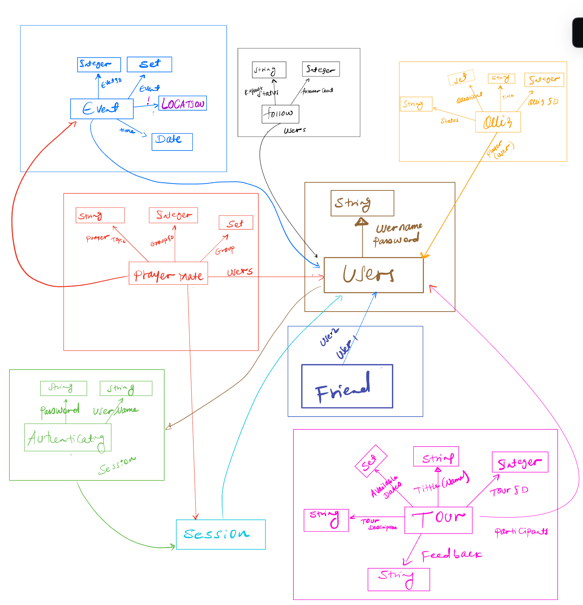

#

# Assignement-4: Backend Design & Implementation

## Data Modeling

### Concept: PrayerMate [User, Event]
#### State
- **PrayerGroups**: set `Event`
- **GroupID**: set `Integer`
- **Members**: set `User`
- **PrayerTopic**: `GroupID` -> one `String`
- **ActiveSession**: `GroupID` -> lone `Session`

### Concept: Calendar [User, Event]
#### State
- **Events**: set `Event`
- **EventID**: one `Integer`
- **HostID**: `EventID` -> one `User`
- **Location**: `EventID` -> one `String`
- **StartTime**: `EventID` -> one `Date`
<!-- - **Subscriptions**: `User` -> set `Event` -->

### Concept: BibleQuiz [User]
#### State
- **Quizzes**: set `Question` -> `String`
- **QuizID**:  set `Integer`
- **Player**: `User` -> set `Question`
- **Title**: one `String`
- **Status**: One `String`

### Concept: Follow [User]
#### State
- **FollowerList**: set `User`
- **Status**: one `String`
- **FollowerCout**: one `Integer`

### Concept: Friend [User]
#### State
- **FriendsList**: set `FriendT`
- **user1, user2**: `FriendT (one friend)` -> one `User`

### Concept: Tour[User, Event]
#### State
- **Tours**: set `Tour`
- **TourID**: set `Integer`
- **Participants**: set `User`
- **AvailableDates**: set `Event`->`TourID` -> set `Date`
- **TourDescription**:  one `String`
- **TourTitle**:  one `String`

### Concept: Authentication
#### State
- **RegisteredUsers**: set `User`
- **Username**: `RegisteredUsers` -> one `String`
- **Password**: `RegisteredUsers` -> one `String`

### Concept: Session[User]
#### State
- **ActiveSessions**: set `Session`
- **User**:  one `User`

