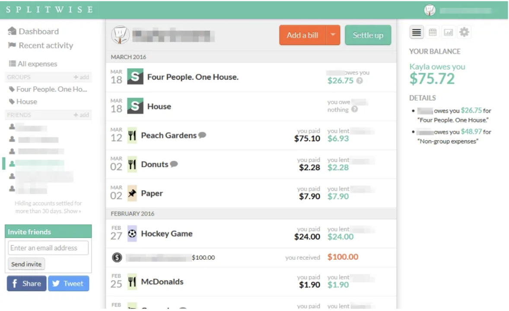
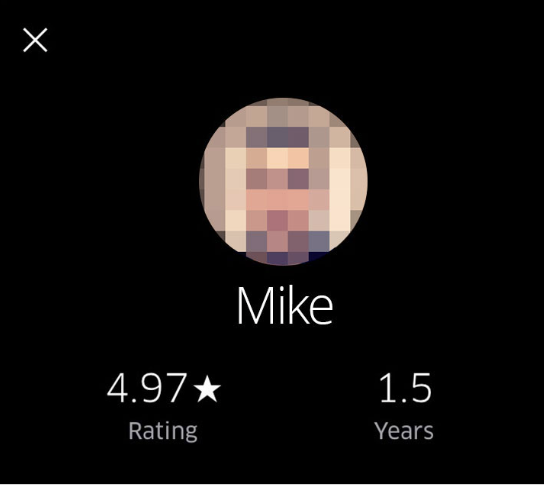

# Project Phase 2: Divergent Design

## Application goals

**Name:** Oscar

**Intended audience:**

- U.S-based close-knit immigrant communities (family, friends, colleagues)
  - Including immigrants away from abroad ROSCA groups
- Communities that are deterred from formal banking institutions for religious, cultural, or larger systemic reasons
- Leaders or members of in-person ROSCA groups looking for a more streamlined, organized experience.

**Value:** Oscar is an app that provides people with

1. Easily accessible, inclusive, community-based financial support system
2. Simple, transparent management of complex group transactions
3. Assurance that their money is secured and in reliable hands
4. Knowledge of global, culturally diverse microfinancial systems

## Comparables

 
Could apply this transaction tracking feature for users to publicly see the sum of money in the pot

 
This kind of stylized emergency button, alert notification used in Among Us is great at conveying the severity of the request. Could be useful to replicate this kind of alert for the SOS feature

 
Chat Widgets in Apple messages could be very useful for accessing ROSCA group discussion and chats and direct messaging with other members

 
Ability to see group member ranking could be modeled off of how uber drivers ratings are available on their personal profile (consistent across groups/rides).

## Potential features

1. **Invite-only ROSCA groups:** Organizers can create and invite members to a ROSCA. Members can join either by QR code or with a unique identifier for the ROSCA.
2. **Individual reputation score:** Like building a credit score, users can build their reputation by making on-time payments to their ROSCA group(s). Users with reputation scores below a certain threshold are disallowed from joining future groups.
3. **Reputation recovery groups:** Give users with excessive missed payments a chance to rebuild their reputation through recovery groups.
4. **Meeting scheduler:** To maintain the communal spirit of traditional ROSCAs, organizers can schedule recurring parties for members. Organizers can gather member availability, and directly schedule either in-person or virtual meetings.
5. **Financial emergency SOS:** In the event of a financial crisis, a member can request a short-term, interest free loan from the pot. Any repayment terms will be agreed upon between the organizer and potentially other members.
6. **Money tracking and goal setting:** Allow all members of a ROSCA to view the grand total of the current pot. Additionally view past history and future projections based on contribution activity.
7. **Payment reminders:** Give organizers the privilege to set the time/frequency of payment reminders for other members.
8. **Finance news and literacy resources (learning center):** Since ROSCAs are primarily utilized by people of developing countries with limited financial literacy, our app can provide a learning center to promote financial education. Curated content will include recent economic news and resources for budgeting, saving, investing, credit building, etc.
9. **Group chats with live translation:** Give all groups a central chat, allowing members to continue fostering community outside of meetups/parties. Chat will also be equipped with live translations to/from the native language of group members.
10. **Payment badges and accomplishments:** Award and incentivize good payment history with digital profile badges and milestones. Badges/achieved milestones can be viewed globally by other members and organizers while determining future pot allocations.
11. **Organizer verification:** Traditional ROSCAs are usually organized by a community member everyone trusts. To maintain this trustworthiness, require organizers to complete a background check first.
12. **Organizer analytics:** Allow organizers to view real-time transaction data and trends in payment history across all members.
13. **Personal financial health dashboard:** To promote the individual financial growth of users, provide a dashboard view of their financial progress. They can compare their expenses against their income and upcoming ROSCA contributions. They can also set goals and track progress towards those goals.
14. **ROSCA rankings:** Within each group, rank members by the timeliness, duration, and magnitude of their contributions. Rankings can be viewed by everyone in the group, incentivizing members to climb the ranks by contributing.
15. **Preferred payees:** At the start of every cycle, give preference to users with exceptional payment history in the pot allocation strategy. Members that regularly make on-time payments will receive the pot earlier in the cycle.
16. **Contributor levels:** Users are assigned an overall “level” on the platform based on their all-time contributions across all ROSCAs. Higher levels = more perks like the ability to join more groups, etc.
17. **Shared member contributions:** To prevent missed payments, allow members to split some or all of an upcoming contribution with another member of the ROSCA. All parties must agree to the split.
18. **Family/friend contributions:** To prevent missed payments, allow a friend/family member outside of the ROSCA to make one-time or recurring contributions on a member’s behalf.
19. **Shared galleries:** Foster community and preserve important moments with a shared collection of photos/videos from meetups, celebrations, and other group-wide events. All members of a ROSCA can contribute to this gallery.
20. **Cultural observances:** To keep cultural practices at the forefront of the experience, program reminders for significant cultural/religious holidays into the app. Allow members to take scheduled ROSCA breaks or changes during these holidays.
21. **Trust referrals:** New members without significant credit/banking history may initially struggle to build their financial reputation. To help mitigate this, allow veteran members of a ROSCA to vouch for new invitees through referrals.
22. **Group voting:** To make the organization process more democratic, allow all members to vote on group rules for the upcoming cycle. At the start of the cycle, members can cast votes on rules like contribution amounts, frequency, and the allocation strategy/order.
23. **Group milestones:** Encourage continued participation in a ROSCA with digital certificates/badges for significant milestones. For example, award the group with a new badge after every 5 successful cycles.
24. **Group-wide marketplace:** Promote financial growth and mutual support among members with an internal resource marketplace. In each group, allow members to promote and purchase goods/services from one another.
25. **Post-cycle reflections:** To promote transparency and bonding, provide members a space to share their reflections at the end of each cycle. They can share how they used the funds, lessons learned, or goals for the next cycle.
26. **Digital pledge board:** To foster transparency, allow members to pledge their commitment, contributions, and intended use of the ROSCA funds at the start of each cycle. The pledge board will be available to view by all members.
27. **Automatic pot reinvestment:** Provide members an option to automatically reinvest their share of the pot into a new cycle. Reinvesting can promote consistent savings habits and greater financial discipline.
28. **Mentorship pairing:** In this digital model, ROSCA may be completely new to younger members, and the tech may be unfamiliar to older members of traditional ROSCA. To support learning and adaptation, pair newer/younger members with older/more experienced members to offer guidance on financial habits, career advice, and/or technology.
29. **Personalized contribution forecasts:** Using predictive models, show members how their personal finances would be impacted if they decrease, maintain, or increase their current levels of contribution.
30. **Community advancement goals:** To advance the needs of the entire community, allow members to optionally agree on contributing a percentage of the pot to a community fund each cycle. This fund will support group-approved causes like public infrastructure, education, events, etc. Members can also view progress towards these collective goals.

## Concept outline

| Name               | Purpose                                                                                           | Operation Principle                                                                                                                                                                                                                   |
| ------------------ | ------------------------------------------------------------------------------------------------- | ------------------------------------------------------------------------------------------------------------------------------------------------------------------------------------------------------------------------------------- |
| Reputation scoring | Allow users to quantitatively determine how reliable/trustworthy other users are.                 | Each user is assigned a publicly visible, numeric score. Actions taken by the user (or a lack thereof) can positively/negatively impact this score.                                                                                   |
| Scheduling         | Allow users to determine and schedule mutually convenient times to meet in-person (or virtually). | A user creates a scheduling opportunity. Other users may add their availability and location preferences to a shared calendar. Once all availability is collected, the system schedules an event at the best time/place for everyone. |
| Pooling            | Enable multiple users to come together and pool resources for a fixed period of time              | A user organizes a pool to continue for some specified time period. The organizer may invite others to join the pool. Members of the pool make regular, fixed contributions until the end of the period.                              |
| Reminding          | Encourage other users to complete time-sensitive tasks                                            | A user creates a reminder for some task by specifying a time and frequency. The user may then select other users to forward the reminder to.                                                                                          |
| Emergencies        | Help users convey a dire situation and an immediate need for assistance to other users.           | after using the emergency button, other users can see the high priority request                                                                                                                                                       |
| Tracking           | Allows the organizer to track how much money is circulating through set of users                  | the organizer will have access to how much each member of the group owes the group                                                                                                                                                    |

## Storyboards

 
 
