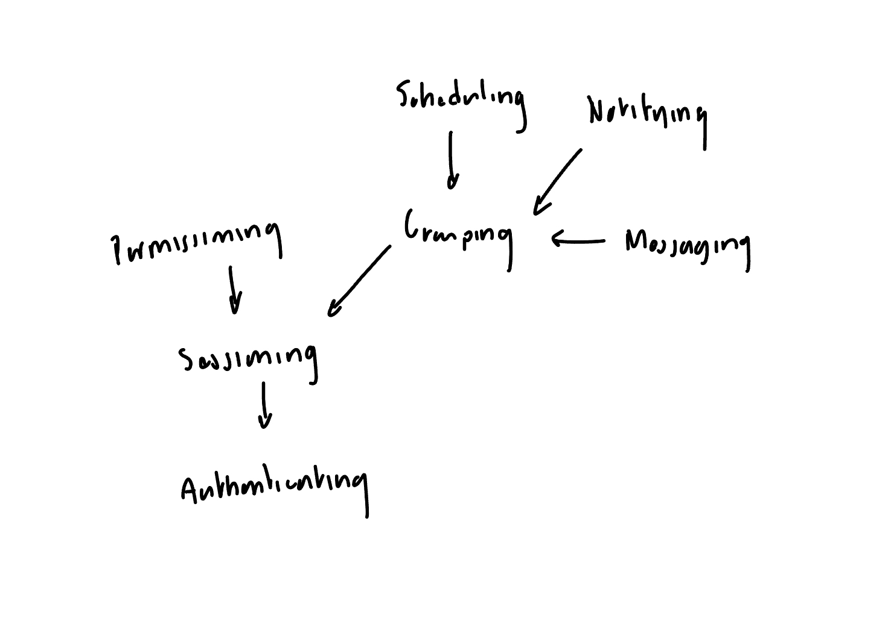

# Project Phase 3: Convergent Design

## Concepts

1. **Concept:** Grouping[User]
   - **Purpose:** Allow invited users to come together, pool resources, and complete tasks together
   - **Operational principle:** A user creates a group and invites other users to join, making them the group owner. Group members can track their pooled resources, and distribute said resources among themselves.
   - **State**
     - groups: **set** Group
     - name: groups -> **one** String
     - owner: groups -> **one** User
     - members: groups -> **set** User
     - value: groups -> **one** Integer
     - cycleStartDate: groups -> **one** Date
     - cycleDuration: groups -> **one** Integer
     - contributionFreq: groups -> **one** Integer
     - contributionAmt: groups -> **one** Integer
   - **Actions**
     ```
       create(n: String, o: User, s: Date, d: Integer, f: Integer, a: Integer, OUT g: Group)
         g := Group; groups += u; c := Contribution:
         g.name := n; g.organzier := organizer; g.members := {o};
         g.value := 0; g.cycleStartDate := s; g.duration := d;
         g.contributionFreq := f; g.contributionAmt := a;
       disband(g: Group, u: User)
         g in groups; g.organizer == u;
         groups -= g;
       addMember(g: Group, u: User)
         g in groups; g.members := g.members + {u};
       removeMember(g: Group, u: User)
         g in groups; g.members -= u;
       getMembers(g: Group, OUT m: members)
         g in groups; m := g.members;
       contribute(g: Group, u: User, v: Integer)
         g in groups; u in g.members;
         g.value := g.value + v
       disburse(g: Group, u: User, v: Integer)
         g in groups; u in g.members;
         g.value := g.value - v
       assertGroupExists(g: Group)
         g in groups;
       assertUserIsOwner(g: Group, u: User)
         g in groups; g.owner == u;
     ```
2. **Concept:** Permissioning[User]
   - **Purpose:** Allows users to see different content based on their permission set
   - **Operational principle:** Users can members and/or members. Organizers have all the permissions of a member, with additional features like creating a group, etc.
   - **State:**
     - organizers: **set** User
     - members: **set** User
   - **Actions:**
     ```
       addMemberPrivileges(u: User)
         members += u;
       addOrganizerPrivileges(u: User)
         organizers += u;
       removeOrganizerPrivileges(u: User)
         organizers -= u;
       assertUserIsOrganizer(u: User)
         u in organizers;
     ```
3. **Concept:** Scheduling[User]
   - **Purpose:** Allow users to determine and schedule mutually convenient times to meet in-person (or virtually).
   - **Operational principle:** A user creates a scheduling opportunity. Other users may add their availability and location preferences to a shared calendar. Once all availability is collected, the system schedules an event at the best time/place for everyone.
   - **State:**
     - schedulers: **set** Scheduler
     - organizer: schedulers -> **one** User
     - dates: schedulers -> **set** Dates
     - members: dates -> **set** User
     - **Actions:**
       ```
       setDateRange(user: User, startDate: Date, endDate: Date, OUT s: Scheduler)
          Create a new scheduler, set user as organizer
          Add dates ranging from startDate to endDate
       addAvailability(s: Scheduler, date: Date, user: one User)
         Assert s in schedulers
         If date is in s.dates:
          - Add user to set of members free on that date
       removeAvailability(s: Scheduler, date: Date, user: one User)
         Assert s in schedulers
         If date is in s.dates:
          - Add user to set of members free on that date
       chooseDate(s: scheduler, user: User, OUT date: Date)
         Assert s in schedulers
         If user is organizer:
         - Search through dates, return date with the most members
       ```
4. **Concept:** Messaging[User]
   - **Purpose:** Users can converse with each other via text messages.
   - **Operational principle:** After a message is sent from a sender to a recipient, the recipient can read the message, which changes its status to 'read', until the message is deleted.
   - **State:**
     - messages: **set** Message
     - sender: messages -> **one** User
     - recipient: messages -> **one** User
     - content: messages -> **one** String
     - status: messages -> **one** Status (Status = {unread, read, archived})
   - **Actions:**
     ```
     send (sender: User, recipient: User, content: String, OUT message: Message)
        1. A new Message is created with the specified sender, recipient, and content.
        2. The message is added to the recipient's inbox.
        3. The status of the message is set to unread.
     read (recipient: User, message: Message)
        Preconditions: Message belongs to the recipient’s inbox
        1. The status of the message is updated to read
     delete (recipient: User, message: Message)
        Preconditions: Message belongs to the recipient’s inbox
        1. The message is removed from recipient’s inbox
     archive (recipient: User, message: Message)
        Preconditions: Message belongs to the recipient’s inbox
        1. The status of the message is updated to archived
     recall(sender: User, message: Message):
        Preconditions: The message has not been read by the recipient. The message belongs to the sender.
        1. The message is removed from the recipient's inbox.This action allows the sender to recall or unsend a message that hasn’t been read yet, giving users an extra level of control.
     search(user: User, keyword: String, OUT results: set Message):
        This action allows a User to search their inbox for messages containing a specific keyword.
        1. Returns a set of messages that contain the keyword in their content.
     reply(sender: User, originalMessage: Message, content: String, OUT replyMessage: Message):
        1. A new replyMessage is created with the specified sender, and content.
        2. The replyMessage maintains a reference to the originalMessage to help keep the context in a
        3. The replyMessage is added to the recipient's inbox with a status of unread.
     ```
5. **Concept:** Notifying[User]
   - **Purpose:** To convey a time-sensitive matter requiring action in a brief, temporary message to a set of recipients
   - **Operational principle:** Users can notify other users about emergencies or send reminders about upcoming meetings or payments, and curate the message specifically
   - **State:**
     - notifications: **set** Notification
     - message: notifications -> **one** String
     - sender: notifications -> **one** User
     - recipients: notifications -> **set** String
     - actionType: notifications -> **one** ActionType (ActionType = {Payment, Reminder, SOSAlert})
   - **Actions:**
     ```
     createNotification(sender: User, recipients: User[], content: String, action: actionType)
        A new Notification is created with:
        - sender set to given sender.
        - recipients set to the specified recipients.
        - actionType set to action.
        - message set to content.
     searchNotifications(user: User, keyword: String, OUT results: Notification[])
        Allows a user to search for notifications containing a specific keyword.
        Returns a set of notifications that contain the keyword in their message.
     ```

## Dependency Diagram



## Synchronizations

```
app Oscar
    include Authenticating, Grouping[Authenticating.User], Permissioning[Authenticating.User], Scheduling[Authenticating.User], Messaging[Authenticating.User], Notifying[Authenticating.User]

sync addOrganizer(u: User)
    Permissioning.addOrganizerPrivileges (u)

sync organizeGroup (name: String, user: User, start: Date, duration: Integer, freq: Integer, amt: Integer, OUT group: Group)
    when Permissioning.assertUserIsOrganizer (user)
    Grouping.create(name, user, start, duration, freq, amt, group)

sync disbandGroup(user: User, group: Group)
    when Permissioning.assertUserIsOrganizer(user)
    Grouping.assertUserIsOwner(group, user)
    Grouping.disband(group, user)

sync makeContribution(group: Group, user: User, value: Integer)
    Grouping.contribute(group, user, value)

sync makePayout(group: Group, user: User, value: Integer)
    Grouping.disburse(group, user, value)

sync requestMeetingAvailability(user: User, group: Group, dateStart: Date, dateEnd: Date, msg: String, action: ActionType, OUT s: Scheduler)
    when Grouping.getMembers(group, members)
    Scheduling.setDateRange(user, dateStart, dateEnd, scheduler)
    Notifying.createNotification(user, members, msg, action)

sync addAvailability(user: User, date: Date, scheduler: Scheduler)
    Scheduling.addAvailability(scheduler, date, user)

sync removeAvailability(user: User, date: Date, scheduler: Scheduler)
    Scheduling.removeAvailability(scheduler, date, user)

sync sendEmergencySOS(user: User, group: Group, msg: String, action: ActionType, OUT n: Notification)
    when Grouping.getMembers(group, members)
    Notifying.createNotification(user, members, msg, action)

sync sendPaymentReminder(user: User, group: Group, msg: String, action: ActionType)
    when Permissioning.assertUserIsOrganizer(user)
    Grouping.assertUserIsOwner(group, user)
    Grouping.getMembers(group, members)
    Notifying.createNotification(user, members, msg, action)

sync sendMessage(sender: User, group: Group, content: String)
    when Grouping.getMembers(group, members)
    for recipient in members:
        Messaging.send(sender, recipient, content, message)
```

## Visual Design Study

[Link to slides](https://docs.google.com/presentation/d/1Quqzt2-apsNIZY8JpYUU5dHNnswlzgmrzjgr9w5SKcY/edit?usp=sharing)

## Wireframes

[Figma link](https://www.figma.com/proto/MVGBqp7x2k5w4ne2zxCgS1/6.1040-Oscar-Prototype?node-id=9-4&node-type=canvas&t=K10lI56XIkc2Bq7r-1&scaling=scale-down&content-scaling=fixed&page-id=0%3A1&starting-point-node-id=9%3A4&show-proto-sidebar=1)

## Heuristic Evaluation

#### Usability

- **Discoverability:** The use of clear labels like "Create an Account," "Login", "Organize a ROSCA group", "Join a ROSCA group as a Member," and "Schedule a Meeting" makes it straightforward for users to understand what actions are available. It supports the heuristic by offering clear entry points for key tasks.
  - Suggestion: We could introduce brief explanatory texts that appear when the user hovers over items, i.e., for buttons that need to be clarified in meaning.
  - Tradeoff: Adding more explanatory text or visual aids could slightly clutter the clean interface but would improve initial discoverability.
- **Error Tolerance:** Confirmation dialogs for actions like "SOS Sent" and "Message Sent" indicate an effort to prevent errors but do not appear for all potentially harmful actions (e.g., "Rejecting Invite" & "generating a lottery winner").
  - Suggestion: Expand confirmation dialogs to all high-risk actions.
  - Tradeoff: Adding too many prompts could frustrate users by interrupting workflows, especially for experienced users familiar with the system.

#### Physical

- **Fitts’ Law:** Actions like Organize a ROSCA group and Join a ROSCA group as a member are displayed on the permissioning screen with large buttons, making them easy to locate and interact with.
  - Suggestion: Ensure that the size and spacing of these buttons remain consistent across different device sizes (like mobile and desktop) for accessibility.
  - Tradeoff: Expanding button sizes may reduce the space available for additional contextual instructions on smaller screens.
- **Mapping:** Navigation menus such as “Home” and “Login” are consistent and logically placed at the top, making it easy for users to understand where they are within the app.
  - Suggestion: Highlight the current page (e.g., bold the tab or change its color) to reinforce situational context.
  - Tradeoff: Introducing color changes for active tabs might slightly disrupt the app's overall visual consistency, depending on the chosen design palette.

#### Linguistic

- **Speaking a user's language**: Our app's wireframe seems to speak a user's language well by using commonplace, nontechnical phrases like "Join a group," "Contribute to pot," etc. We provide helpful confirmation messages like "Message sent," "SOS sent," and "Invitation sent" to help users evaluate whether they've successfully executed a task
  - Suggestion: On a more literal level, we could add a translation option since we are targeting more culturally diverse audiences
- **Information scent:** Our buttons are labeled quite descriptively with phrases like "Schedule meeting," "Organize/join a group," and "Generate winner"
  - Suggestion: We could add some central text like "My Groups" or "Group Dashboard" to the page where members/organizers can view all the groups they've joined

## Project Plan

- Our team will prioritize Permissioning and Scheduling in P4. If there is additional time, we will also attempt to implement Grouping.
- In P5, we will implement Notifying, Messaging, and if needed Grouping.

#### P3 Tasks (DEADLINE: NOVEMBER 20th)

- [x] Heuristic evaluation
  - **Yonas:** Usability criteria
  - **Manasa:** Physical
  - **Angel:** Linguistic
- [x] Define concept states and actions
  - **Ashi:** Scheduling & Messaging
  - **Manasa:** Notifying
  - **Angel:** Grouping & Permissioning
- [x] **Angel:** Synchronizations

#### P4 Tasks (DEADLINE: NOVEMBER 27th)

- [x] **Angel:** Setup Vercel deployment and MongoDB
- [ ] Implement Permissioning
  - [ ] **Ashi:** Implement the back-end
    - Create a data model/representation
    - Develop RESTful routes
  - [ ] **Manasa:** Implement the front-end
    - Implement basic component functionality and reactivity
    - Front-end data store
    - Synthesize components into views
- [ ] Implement Scheduling
  - [ ] **Angel:** Implement the back-end
    - Create a data model/representation
    - Develop the RESTful Routes
  - [ ] **Yonas:** Implement the front-end:
    - Implement basic component functionality and reactivity
    - Front-end data store
    - Synthesize components into views

#### Deadlines

- Back-End: **Due Nov 22, 2024 10:00 PM**
- Pre-Debug Front-End and Back-End: **Due Nov 25, 2024 8:00 PM**
- Final Alpha Deployment: **Due Nov 27, 2024 11:59 PM**

#### Backup plan

If we're cutting it close before a deadline, we can reduce the scope of our Scheduling concept by scrapping of some of the intended actions (i.e recommending scheduled times). We've also agreed that we're okay with dropping our Messaging concept if we run low on time, as it is an additional feature but not central to the core functionality of our app. If a pair realizes they can’t implement a concept (or a section of the concept) by the deadline, first, ask for help from the other pair. We'll attempt a simpler implementation or ask Dana for guidance before scrapping any concepts completely. We can also redistribute the work, and at worst switch pairs to get some additional hands on the concept.
