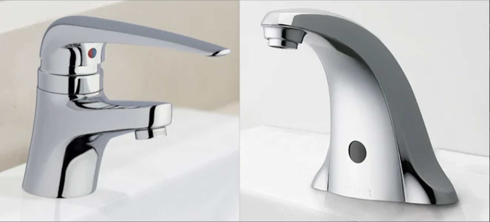
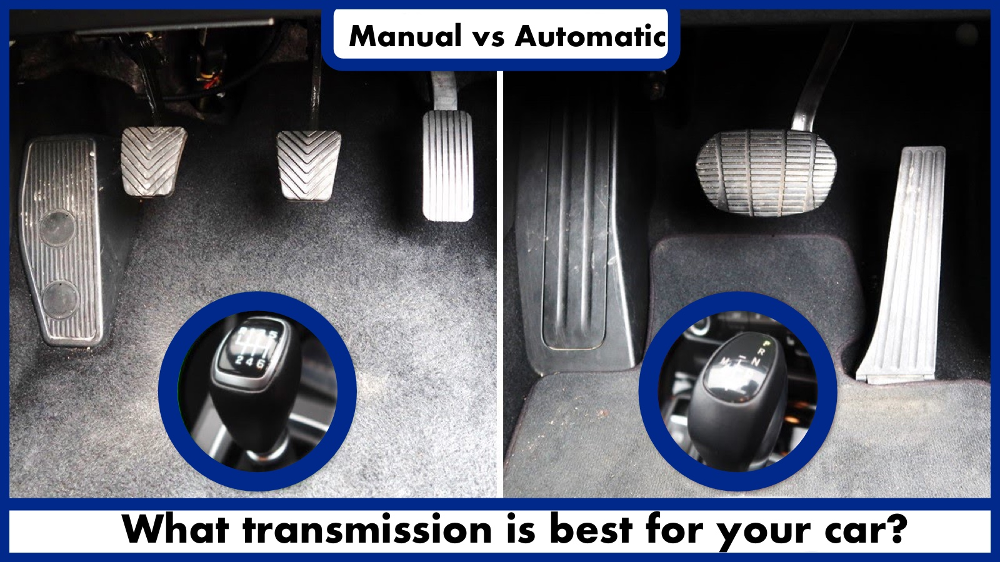
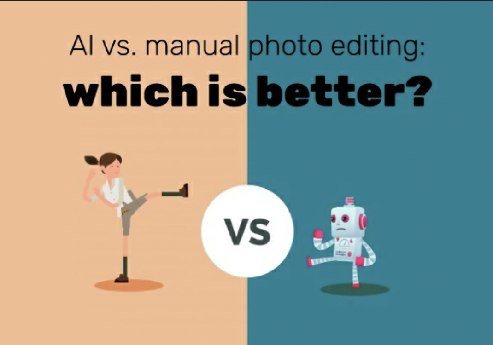
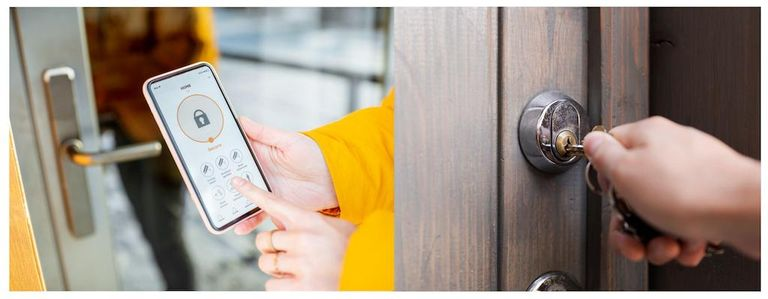

## Exploring Design Moves in Everyday Technology

In lecture, we discussed the concept of loosening and tightening design moves, which got me thinking about a few technologies we encounter daily. Below are some examples from the physical world and softwares where automation and integration have changed the way we interact with these tools, balancing between convenience and control.

## Automatic Faucets: Manual Operation vs Motion-Sensing

Traditional faucets typically required manual adjustments to control water flow and temperature. Each action—turning the tap on, setting the flow rate, and adjusting the temperature was separate, giving users complete control over their water usage. However, automatic faucets, now commonly found in public restrooms, have tighthened these functions by using motion sensors to activate the water flow without manual input.

This integration offers several benefits, such as improved hygiene (since we don’t have to touch the faucet) and water efficiency, as the faucet only runs when hands are detected. Yet, this tightening of control also removes flexibility; users can no longer adjust the water temperature or flow rate to their preference. In situations where water needs to be hotter or cooler, or when more water pressure is required, the automation limits the faucet’s usability, revealing the downside of this design move.
{ width=400 height=400 }

## Automatic Car Transmission vs Manual Transmission

Most modern cars come equipped with automatic transmission systems that merge the traditionally separate actions of shifting gears and controlling speed into one automated function. In manual transmission vehicles, drivers have to engage a clutch and shift gears themselves, giving them greater control over the vehicle’s acceleration, power, and overall performance.

While automatic transmissions offer convenience, reduce driver effort, and make cars easier to operate, they also remove certain capabilities such as engine braking and the ability to optimize fuel efficiency through gear selection. This tightening move, where the system takes over manual tasks, can lead to a loss of control and driving satisfaction for enthusiasts who prefer to manage each gear change and directly influence how the car responds to their inputs.
{ width=400 height=400 }

## Photo Editing Software: Manual Edits vs Automated Enhancements

In older photo editing software like Adobe Photoshop users had to manually adjust various parameters such as brightness, contrast, and color balance, which allowed for precise control over the image’s appearance. Today, newer tools like Google Photos and smartphone apps provide “Auto Enhance” options that bundle these individual edits into a single click, instantly applying enhancements based on what the algorithm predicts will look best.

While this is a tightening move that significantly simplifies the photo editing process—making it accessible to users with minimal editing skills—it also removes the flexibility to fine-tune each parameter. This can be frustrating for those who want to highlight specific details or have creative control over the look of their photos. The automated approach might not always produce the desired effect, leaving users with limited options to revert to manual adjustments. I always find myself trying the automated enhancement first, but then going back to manual edits to get the exact look I want. I am glad they still keep the manual options available!😃
{ width=400 height=400 }

## Electronic Door Locks vs Traditional Key Locks

Traditional key locks provided a straightforward method of securing a door—insert the key, turn it, and lock or unlock the door. This gave users full control over access. In contrast, electronic door locks, such as smart locks, unify access control and security management by allowing users to unlock doors with a smartphone or keypad, and even monitor entry history remotely.

This automation enhances convenience and adds features like remote locking/unlocking and temporary digital keys for guests. However, it also introduces new vulnerabilities. If the electronic system malfunctions, loses power, or the user’s phone dies, access can be denied, leading to potential lockouts. This tightening move, which combines physical locking with digital control, can be both a blessing and a curse depending on the situation.
{ width=400 height=400 }

## Conclusion

Tightening design moves in everyday technologies can streamline interactions but often reduce user flexibility and control. Examples like automatic faucets and photo editing software simplify usage by merging multiple functions, but limit customization options. Similarly, automatic car transmissions and electronic door locks automate tasks for convenience, but may restrict user control and introduce new limitations. While these design moves offer clear benefits, they also highlight the trade-offs between automation and user autonomy. As technology continues to evolve, finding the right balance between convenience and control will be crucial in creating user-friendly experiences that cater to diverse needs and preferences.🤔
