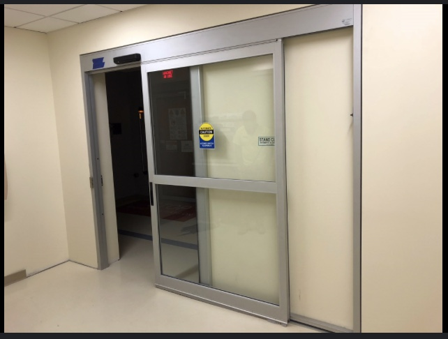

# Usability and Safety of Automatic Sliding Doors and what Software Designers can Learn from it

Automatic sliding doors are widely used in public places such as shopping malls, airports, hospitals, and office buildings. They are designed to provide a seamless entry and exit experience by automatically opening when they detect a person’s presence.

## Usability of Automatic Sliding Doors

Automatic sliding doors are highly user friendly because they eliminate the need to physically push or pull a door, making them ideal for high-traffic areas and people carrying items or those with limited mobility. These doors open and close automatically when motion is detected, allowing people to enter and exit quickly without breaking their stride. Additionally, they help maintain temperature control within buildings by minimizing the time the door is open, contributing to energy efficiency. The simplicity and intuitiveness of automatic sliding doors make them accessible to almost everyone, including children, elderly people, and those with disabilities.

Another usability benefit is that these doors reduce bottlenecks at entry and exit points in busy locations by accommodating multiple people at once. The large, clear panels also allow users to see through to the other side, reducing confusion and enhancing wayfinding for people unfamiliar with the environment.
{ width=400 height=400 }

## Safety Analysis of Automatic Sliding Doors

While automatic sliding doors are convenient, they also present safety challenges. One issue is the risk of the doors closing on someone too quickly if the sensors fail to detect them properly. This could potentially cause injuries, especially to children or individuals moving slowly. To mitigate this risk, most automatic doors include safety sensors that detect the presence of a person or object in the doorway and prevent the door from closing until it is clear. However, these sensors can sometimes malfunction or be improperly calibrated, leading to accidents.

Another safety concern is the possibility of doors malfunctioning due to power failures or mechanical issues, potentially trapping people inside or causing panic during emergencies. This is why many automatic sliding doors are equipped with manual override options or emergency push buttons that allow for manual operation in case of a malfunction. Regular maintenance and testing of these safety features are crucial to ensure that they operate reliably.

Lastly, because automatic sliding doors are often installed in busy areas, there is a potential for collisions if people do not notice the door closing. To address this, visual and audible cues, such as flashing lights or beeping sounds, are sometimes incorporated to alert users when the door is in motion. Additionally, a middle divider line can be added to the door to make it more visible to users, helping to avoid collisions when the door is closed.

## What Software Engineers(Designers) Can Learn from This

Software engineers can learn valuable lessons from the usability and safety considerations of automatic sliding doors, which demonstrate the importance of balancing user convenience with safety. Just like these doors incorporate safety features such as sensors and manual overrides to ensure user protection, software systems should include error handling, backups, and failsafe mechanisms to maintain functionality during failures. Moreover, the ease of use and intuitive design of automatic doors emphasize the need for user-centric design in software development, making products accessible to a broad range of users. However, achieving this convenience often involves trade-offs: prioritizing usability can introduce security vulnerabilities or reduce control, while prioritizing safety can result in less responsive or cumbersome interactions. Engineers should understand these trade-offs and make informed decisions by weighing usability against potential risks, ensuring a well-balanced design that maintains both a smooth user experience and robust safety. Regular testing and maintenance are also essential, just as with physical systems, to prevent issues and sustain performance over time.
